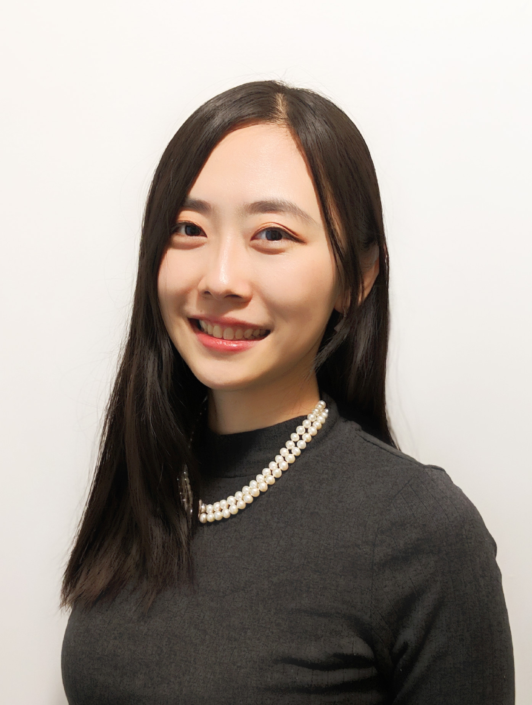

I am a Ph.D. student in the [Computer Science Department](http://www.bu.edu/cs/) at Boston University. I am advised by Professor [Brian Kulis] (http://people.bu.edu/bkulis/). My academic interests broadly include Machine Learning, Image Segmentation, Representation Learning, and Data Mining.

Before BU, I was a ME student in [Computational Science and Engineering](http://iacs.seas.harvard.edu/)  at Harvard. During 2013 and 2016, I've been fortunate to work with Dr. Mohammed AlQuraishi  and Professor Peter Soger at the Sorger Lab and the Laboratory of Systems Pharmacology at Harvard Medical School.  Before coming to Harvard, I received my M.S. degree in Computer Engineering at Brown University. During my undergraduate at Beijing Institute of Technology, I studied in Information and Electrical Engineering.

[curriculum vitae ]({{ BASE_PATH }}/assets/xide_xia_cv_bu.pdf)

---

<h4>contact</h4>

Xide Xia 

Email: xidexia@bu.edu  
<a href="http://www.bu.edu/cs/">Department of Computer Science</a> 
<a href="http://www.bu.edu">Boston University</a> 
111 Cummington Mall 
Boston, MA 02215 
USA  

